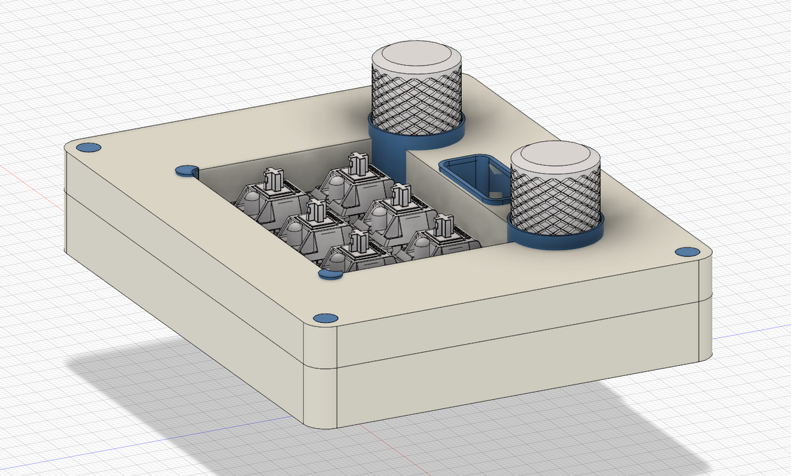
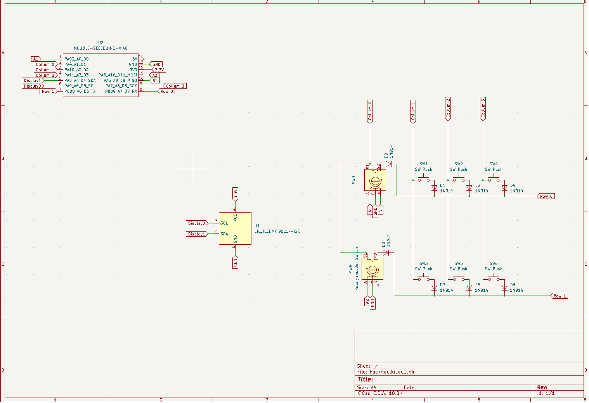
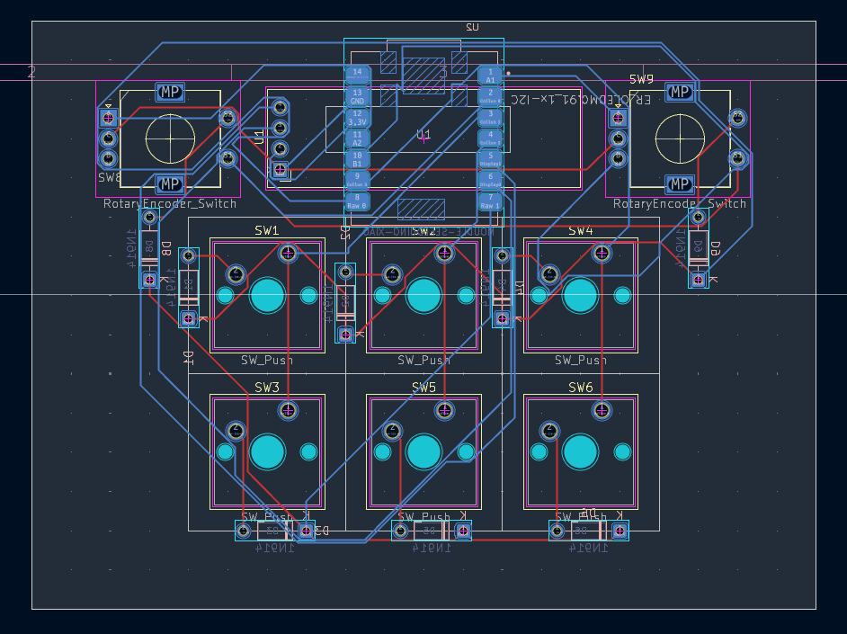

# InpettoPad

The InpettoPad is a 6 Key Macropad featuring 2 rotary encoder,  
an OLED display and a built in clock feature! It´s using  
QMK Firmware and ONLY runs on MacOS.

# Features:

- Bottom and Top 3D Printed Case
- 128x32 OLED Display
- 2x EC11 Rotary encoder
- 6x MX-Style Switches

# Cad Model:

Everything fits together using 4 3D printed "Screws". The PCB itself is lying on a podest inside the case.  
It´s printed in 3 Parts:  
The 4 "Screws"  
The upper Case  
The lower Case  

## Quick picture of the Case:

# PCB and Schematic

## Heres my PCB and Shematic, which were both made in KiCad.

  
*I used "MX_PUSH" from KiCAd for the keyswitch footprints.*

# Firware
Used abriviations:  
P/H = Press and Hold 
S. Press = Press 
d. press = Double Press 
X/X = Row(In assembeled Key board) / Position in Row ( 0, 1, 2) ** 0 being all the way down/ to the left 
r.t.l/r. = rotate to left/right  

## Functions: 
   Display Lock (Key,0/0) [S. press -> Lock Display, d. press -> shutdown menu] 
   ShortCut to Claude/AI of your choice (Key, 0/1) [S. press -> AI] 
   ScreenShot(Key, 0/2) [S. press -> Screenshot, P/H -> Recording] 
   AudioPlayer(Key, 1/1) [S. Press -> Play/pause, d. press -> previous Song, P/H -> Skip Song] 
   Light Controle(Key, 1/2) [S. press -> Light toggle]ts and link it to either the application or a web link of your favourite AI. 
   Focus Toggle(Key, 1/0) [S. press -> Focus toggle]  
   Volume Controle(Rotary Encoder, Right) [r.t.r. -> Volume Up, r.t.l. -> Volume Down, S. press -> Mute Audio] 
   FullScreen Toggle(Rotary Encoder, Left) [r.t.l/r. -> Switch to either Full or not-Full screen] 
   Clock(Rotary Encoder, Left) [s. press -> Enter Clock setting mode THEN AFTER S.PRESS r.t.l/r -> Set Time]  

## SetUp:  
Due to non existing Keyboard Commands on MacOS some Functions have to be SetUp in Apple Shortcuts!! 

### 1. Shortcut to CLaude: 
To set Up enter the KeyCombination (Left Command, Left Shift and C) in a new Shortcut in Apple Shortcuand link it to Apple Home Smart Home remote conrole. 
### 2. Light Controle: 
To set Up enter the KeyCombination (Left Command, Left Shift and L) in a new Shortcut in Apple Shortcuts  
### 3. Focus Toggle: 
To set Up enter the KeyCombination (Left Command, Left Shift and F) in a new Shortcut in Apple Shortcuts and set it to enable/disable your Focus of choice.

# BOM
### Here should be everything you need to make this hackpad   
6x Cherry MX Switches 
6x DSA Keycaps 
8x 1N4148 DO-35 Diodes. 
1x 0.91" 128x32 OLED Display 
2x EC11 Rotary Encoder 
1x XIAO RP2040 
1x Case (3 printed parts) 

